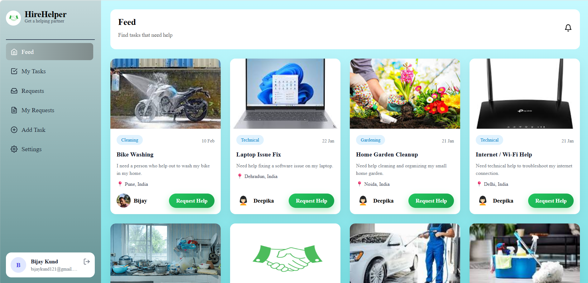
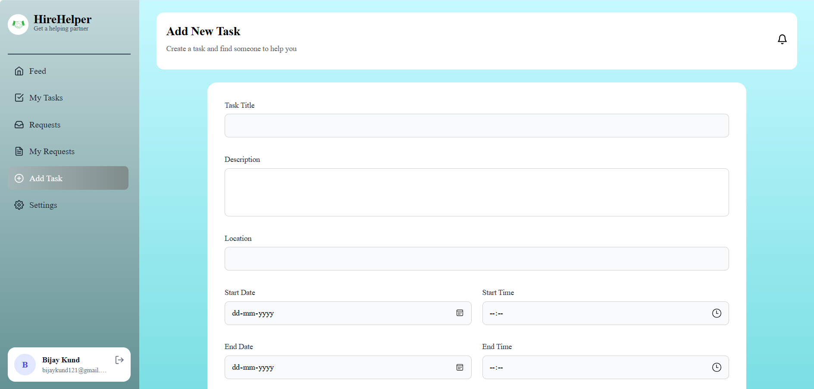
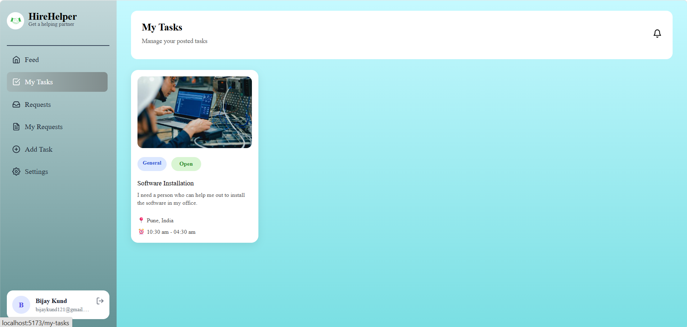
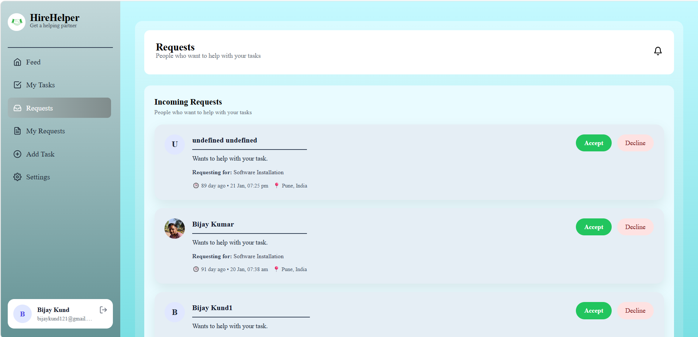
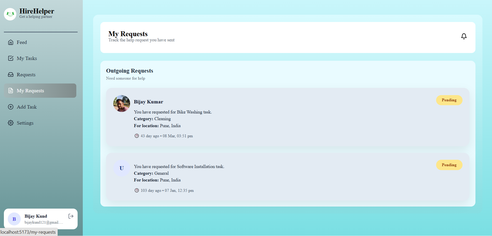
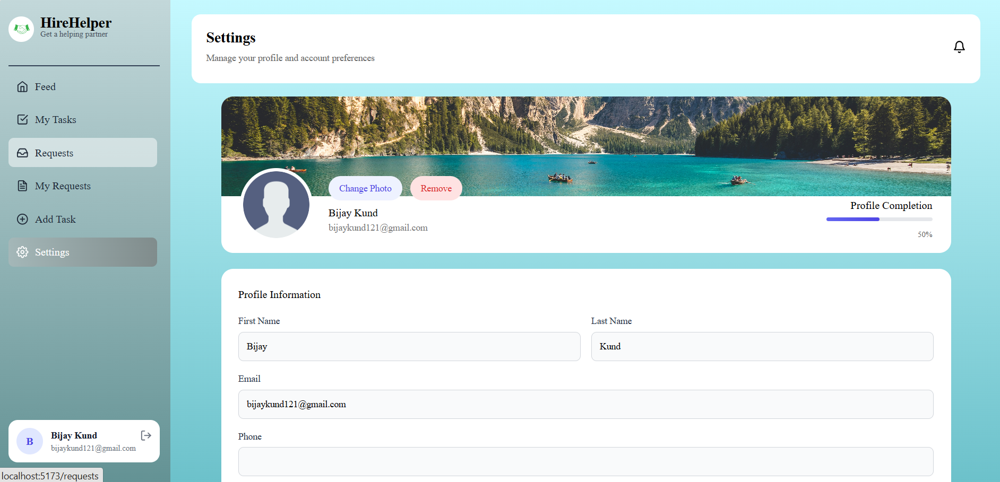
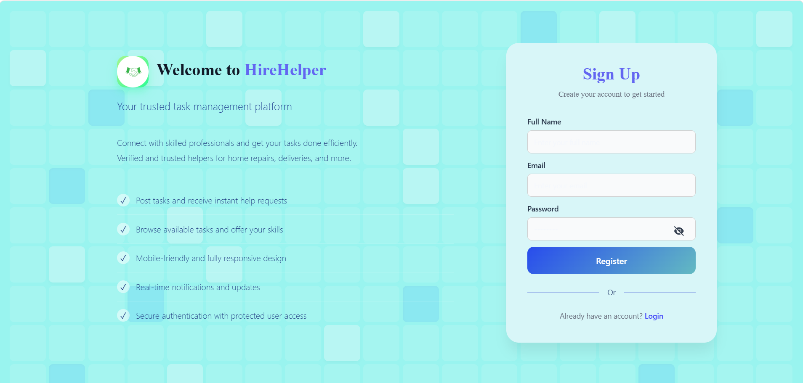

# 💼 HireHelper – Smart Task & Request Management System

HireHelper is a full-stack web application designed to streamline **task management and request handling**. It enables users to create tasks, manage requests, track activities, and maintain productivity through an intuitive interface.

---

## 🚀 Key Features

- 📝 Task Management – Create, update, and manage tasks efficiently  
- 📥 Request Handling – Send and manage service/task requests  
- 📊 Activity Feed – Track recent actions in real-time  
- 🔐 Authentication System – Secure login & user management  
- ⚙️ User Settings – Customize profile and preferences  
- 📌 Task Tracking – Monitor progress of assigned tasks  
- 📱 Mobile responsive design
- 🔔 Real-time notifications

---

## 🖥️ Screenshots

### 🏠 Dashboard / Home

### ➕ Add Task

### 📋 My Tasks

### 📨 Requests

### 📥 My Requests

### ⚙️ Settings

### 🔐 Login

### 📝 Sign Up

### 🔑 Forgot Password

---

## 🛠️ Tech Stack

### 🎨 Frontend
- React.js (Component-based UI)
- HTML5, CSS3, JavaScript (ES6+)
- Vite (Fast development build tool)

### ⚙️ Backend
- Node.js (Runtime Environment)
- Express.js (REST API development)

### 🗄️ Database
- MongoDB (NoSQL database)

### 🔐 Authentication
- JWT (JSON Web Tokens) / Session-based Authentication

### 🔗 APIs
- RESTful APIs (Client-server communication)

### 🧰 Tools
- Git & GitHub (Version control)
- npm (Package manager)
- nodemon (Auto-restart backend server)

---

## 📂 Project Structure
